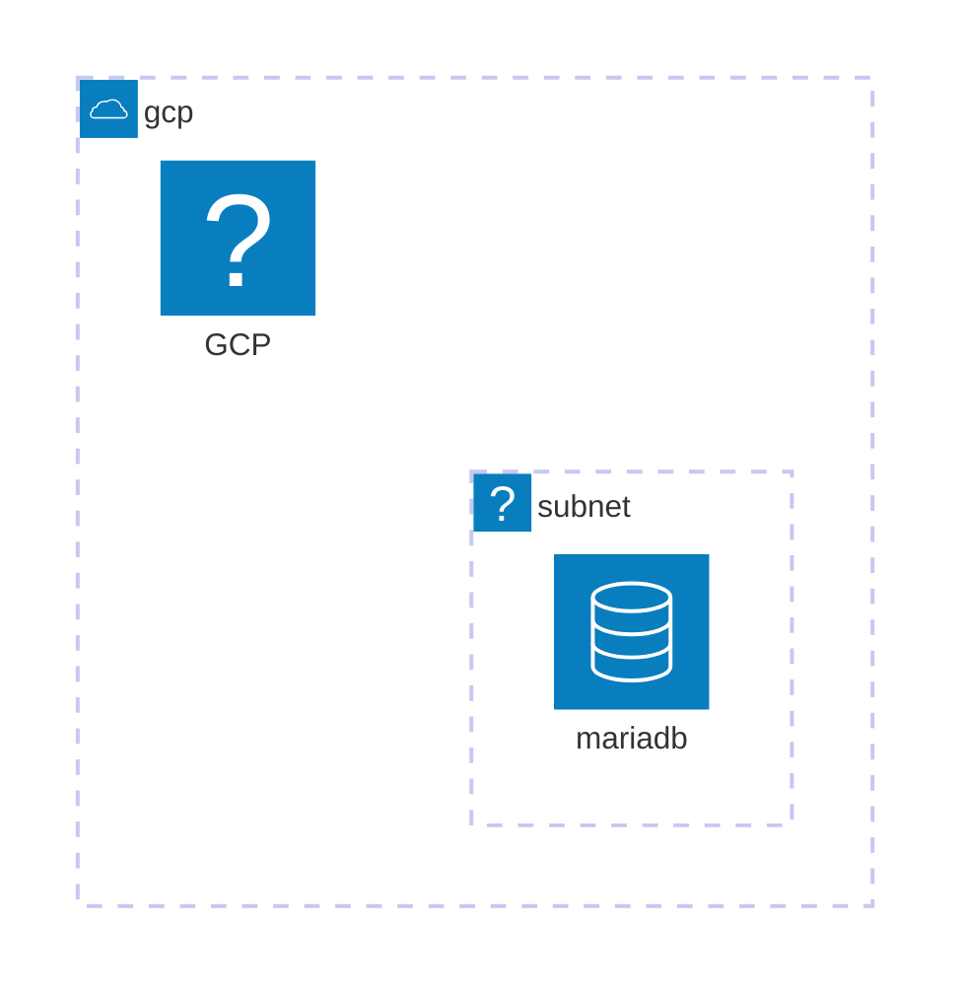
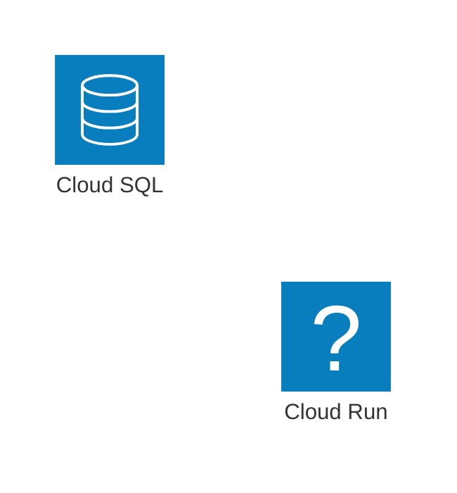
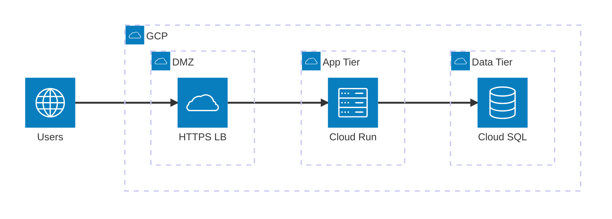
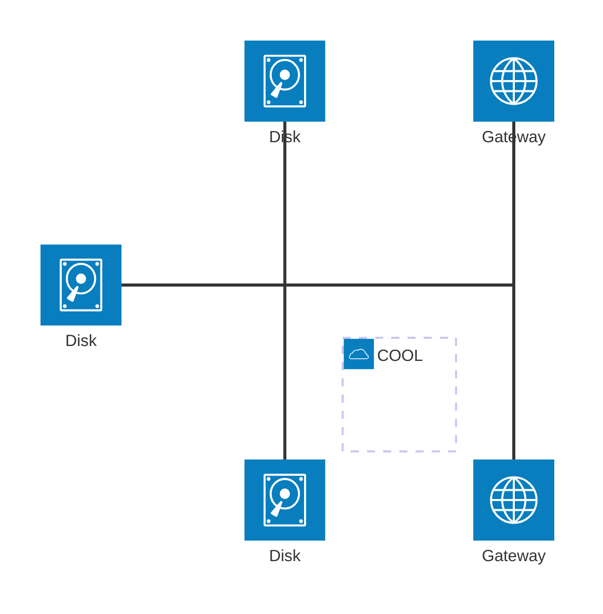
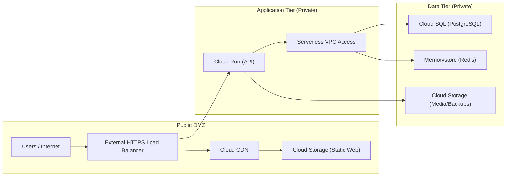
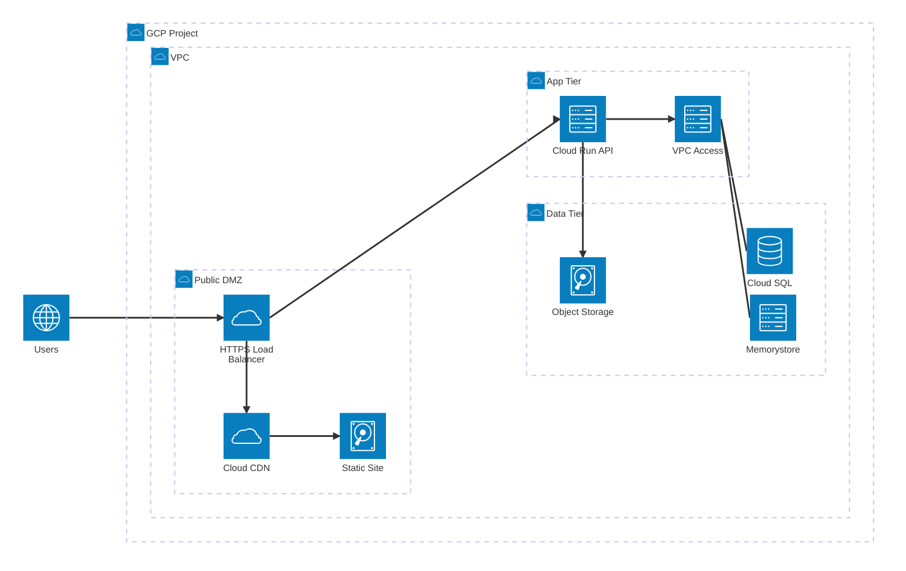

```mermaid
architecture-beta
group vpc(cloud)[gcp]
group subnet(dmz)[subnet] in vpc
service db(database)[mariadb] in subnet
service gcp(logos:google-cloud)[GCP] in vpc

```

```mermaid
architecture-beta
service run(logos:google-cloud-run)[Cloud Run]
service sql(database)[Cloud SQL]
```

```mermaid
architecture-beta
group gcp(cloud)[GCP]
group dmz(cloud)[DMZ] in gcp
group app(cloud)[App Tier] in gcp
group data(cloud)[Data Tier] in gcp


service users(internet)[Users]
service lb(cloud)[HTTPS LB] in dmz
service api(server)[Cloud Run] in app
service sql(database)[Cloud SQL] in data


users:R --> L:lb
lb:R --> L:api
api:R --> L:sql

```

```mermaid
architecture-beta
group cool(cloud)[COOL]
service left_disk(disk)[Disk]
service top_disk(disk)[Disk]
service bottom_disk(disk)[Disk]
service top_gateway(internet)[Gateway]
service bottom_gateway(internet)[Gateway]
junction junctionCenter
junction junctionRight

left_disk:R -- L:junctionCenter
top_disk:B -- T:junctionCenter

bottom_disk:T -- B:junctionCenter
junctionCenter:R -- L:junctionRight
top_gateway:B -- T:junctionRight
bottom_gateway:T -- B:junctionRight

```

```mermaid
flowchart LR
%% Simple, compatible 3-tier GCP diagram


subgraph "Public DMZ"
Internet["Users / Internet"]
LB["External HTTPS Load Balancer"]
CDN["Cloud CDN"]
FE["Cloud Storage (Static Web)"]

Internet --> LB --> CDN --> FE
end

subgraph "Application Tier (Private)"
API["Cloud Run (API)"]
VPCX["Serverless VPC Access"]
API --> VPCX
end

subgraph "Data Tier (Private)"
SQL["Cloud SQL (PostgreSQL)"]
REDIS["Memorystore (Redis)"]
GCS["Cloud Storage (Media/Backups)"]
end


%% Cross-tier flows
LB --> API
VPCX --> SQL
VPCX --> REDIS
API --> GCS


```

```mermaid
architecture-beta
group proj(cloud)[GCP Project]
group net(cloud)[VPC] in proj
group dmz(cloud)[Public DMZ] in net
group appg(cloud)[App Tier] in net
group datag(cloud)[Data Tier] in net

service users(internet)[Users]
service lb(cloud)[HTTPS Load Balancer] in dmz
service cdn(cloud)[Cloud CDN] in dmz
service fe(disk)[Static Site] in dmz


service api(server)[Cloud Run API] in appg
service vpcx(server)[VPC Access] in appg

service sql(database)[Cloud SQL] in datag
service cache(server)[Memorystore] in datag
service bucket(disk)[Object Storage] in datag

users:R --> L:lb
lb:B --> T:cdn
cdn:R --> L:fe

lb:R --> L:api
api:R --> L:vpcx
vpcx:R -- L:sql
vpcx:R -- L:cache
api:B --> T:bucket


```
