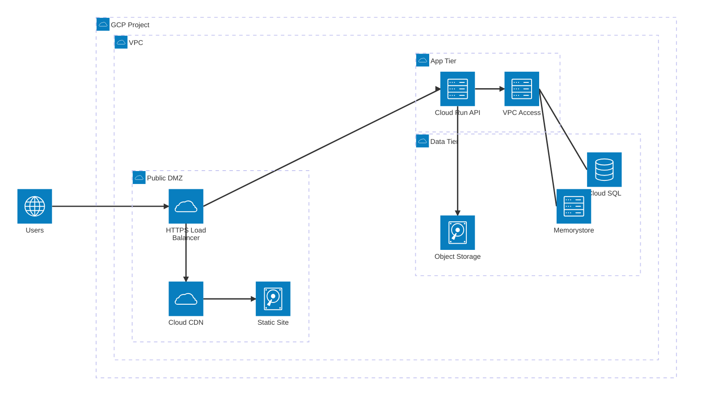

# Groups Services and Edges




```mermaid
flowchart

```

```html
<!doctype html>
<html lang="en">
<head>
    <meta charset="utf-8" />
    <meta name="viewport" content="width=device-width, initial-scale=1" />
    <title>Mermaid Architecture Diagram (standalone)</title>
    <style>
        :root {
            --bg: #0b1020;
            --fg: #e5e7eb;
        }

        html,
        body {
            height: 100%;
        }

        body {
            margin: 0;
            background: var(--bg);
            color: var(--fg);
            font-family: ui-sans-serif, system-ui, -apple-system, Segoe UI, Roboto, Helvetica, Arial, "Apple Color Emoji", "Segoe UI Emoji";
        }

        header {
            padding: 1.25rem 1rem;
            display: flex;
            gap: .75rem;
            align-items: center;
            border-bottom: 1px solid #1f2937;
            background: rgba(255, 255, 255, 0.02);
            position: sticky;
            top: 0;
            backdrop-filter: blur(6px);
        }

        header h1 {
            font-size: 1rem;
            margin: 0;
            opacity: .9;
            letter-spacing: .2px;
        }

        .wrap {
            max-width: 1200px;
            margin: 0 auto;
            padding: 1rem;
        }

        .card {
            background: #0f172a;
            border: 1px solid #1f2937;
            border-radius: 14px;
            padding: 1rem;
            box-shadow: 0 10px 30px rgba(0, 0, 0, .25);
        }

        .hint {
            font-size: .85rem;
            opacity: .7;
            margin: .75rem 0 0;
        }

        pre.mermaid {
            background: transparent;
        }

        a {
            color: #93c5fd;
        }
    </style>
</head>

<body>
    <header>
        <svg width="20" height="20" viewBox="0 0 24 24" fill="none" aria-hidden="true">
            <path d="M4 7h16M4 12h16M4 17h16" stroke="#93c5fd" stroke-width="1.5" stroke-linecap="round" />
        </svg>
        <h1>Mermaid Architecture Diagram (architecture-beta)</h1>
    </header>

    <div class="wrap">
        <div class="card">
            <!--
          Paste your Mermaid definition inside this <pre class="mermaid"> element.
          This page uses Mermaid v11 (ES Module) and supports Architecture Diagrams (architecture-beta).
          By default, the architecture diagram supports these built-in icons: cloud, database, disk, internet, server.
          To use additional icons (e.g. Iconify packs), see the JS section below where we register an icon pack.
        -->
            <pre class="mermaid">
                flow
                architecture-beta
                group proj(cloud)[GCP Project]
                group net(cloud)[VPC] in proj
                group dmz(cloud)[Public DMZ] in net
                group appg(cloud)[App Tier] in net
                group datag(cloud)[Data Tier] in net

                service users(internet)[Users]
                service lb(cloud)[HTTPS Load Balancer] in dmz
                service cdn(cloud)[Cloud CDN] in dmz
                service fe(disk)[Static Site] in dmz

                service api(server)[Cloud Run API] in appg
                service vpcx(server)[VPC Access] in appg

                service sql(database)[Cloud SQL] in datag
                service cache(server)[Memorystore] in datag
                service bucket(disk)[Object Storage] in datag

                users:R --> L:lb
                lb:B --> T:cdn
                cdn:R --> L:fe

                lb:R --> L:api
                api:R --> L:vpcx
                vpcx:R -- L:sql
                vpcx:R -- L:cache
                api:B --> T:bucket
            </pre>
            <p class="hint">Tip: edit the code above and refresh, or call <code>mermaid.run()</code> in the console to
                re-render dynamically.</p>
        </div>
        <p class="hint">No JavaScript framework required. This single file works offline once cached.</p>
    </div>

    <!-- Mermaid JS (ES Module) -->
    <script type="module">
        import mermaid from 'https://cdn.jsdelivr.net/npm/mermaid@11/dist/mermaid.esm.min.mjs';

        // OPTIONAL: Register an Iconify icon pack so you can use e.g. logos:google, logos:gcp, etc
        // Usage in diagram: service x(logos:gcp)[Title]
        // Remove this block if you don't need extra icons.
        try {
            mermaid.registerIconPacks([
                {
                    name: 'logos',
                    loader: () => fetch('https://unpkg.com/@iconify-json/logos@1/icons.json').then(r => r.json())
                },
            ]);
        } catch (e) {
            console.warn('Icon pack registration failed (safe to ignore if not using custom icons):', e);
        }

        // Initialize Mermaid
        mermaid.initialize({
            startOnLoad: true,
            theme: 'dark',
            securityLevel: 'strict',
            // You can tweak layout for architecture diagrams here if needed
            // flowchart: { curve: 'basis' },
        });

        // Expose a tiny helper to re-run if you edit the DOM dynamically
        window.mermaid = mermaid;
    </script>

    <noscript>
        <p style="padding:1rem;color:#fff;background:#7f1d1d">This page requires JavaScript to render Mermaid diagrams.
        </p>
    </noscript>
</body>

</html>
```

```go
package main

func cool(){
    print("this is cool!")
    
}


```
```html
<html
```
