# Flowcharts
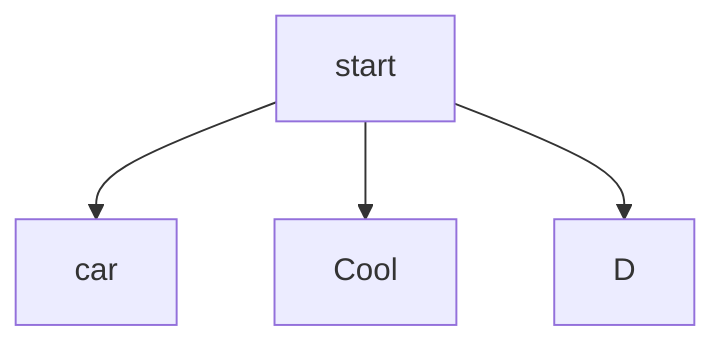
# Chat Orientations
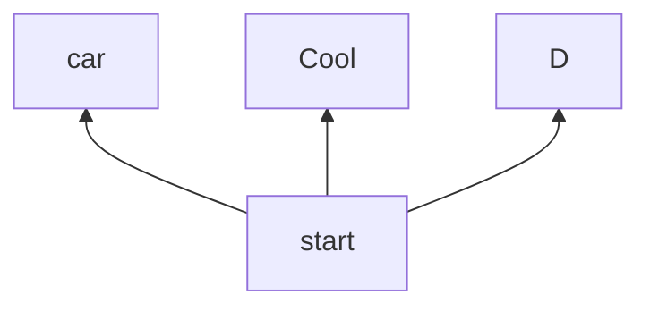

# Node texts

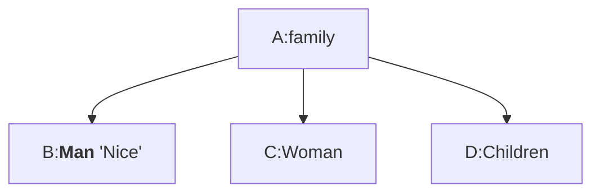

# Links
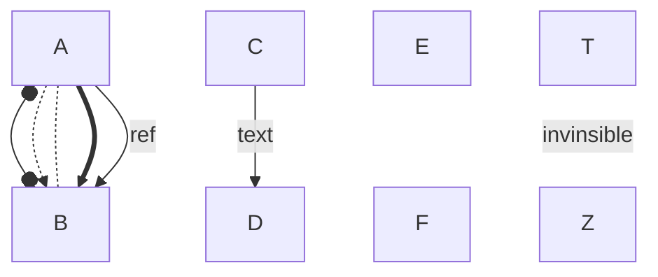

# Advanced Links
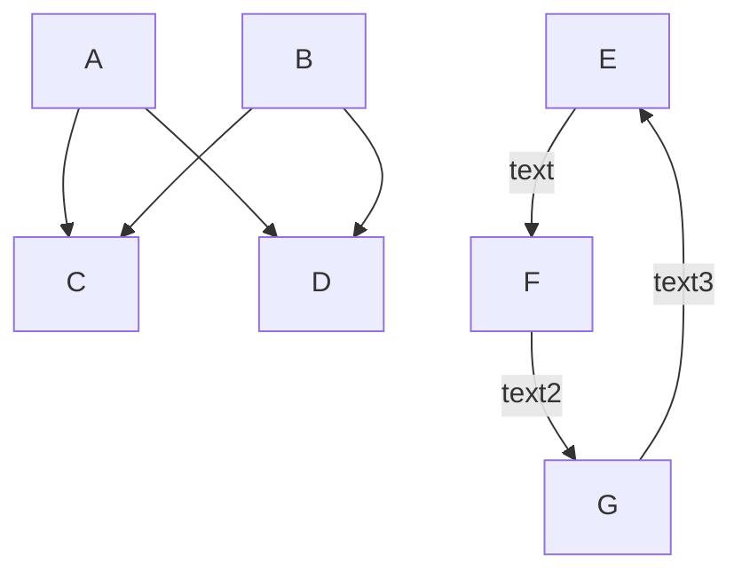

# Real world example

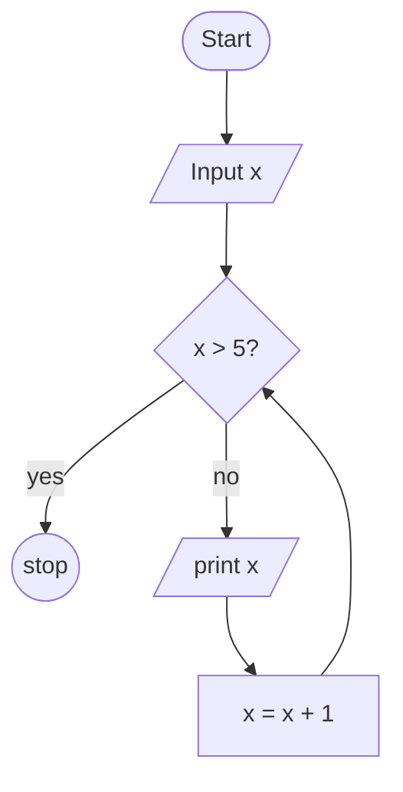
# Subgraphs

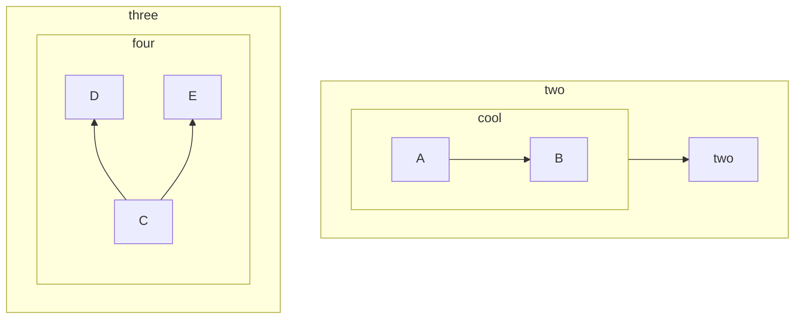

# Styling Lines and Nodes

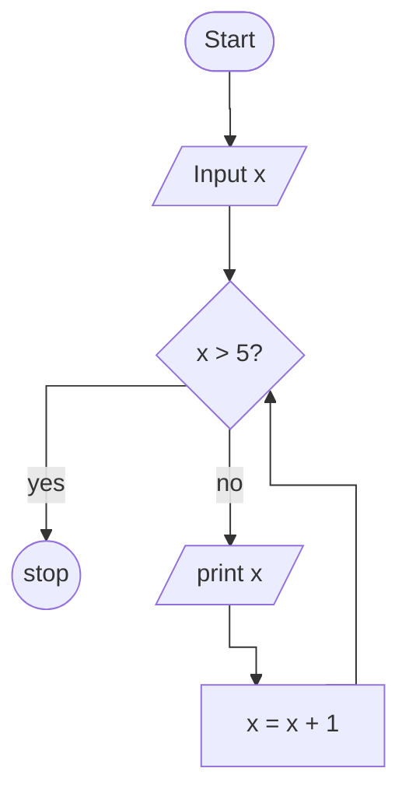

# Real World Kubernetes

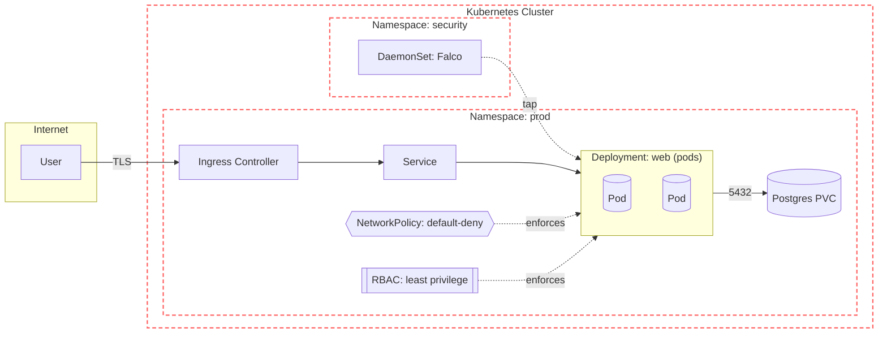

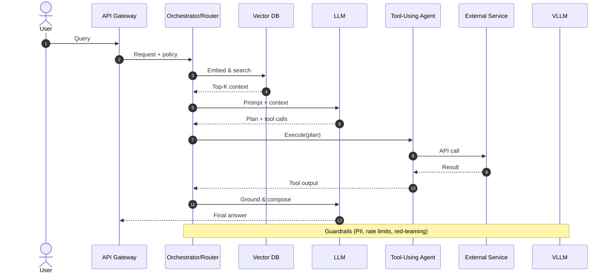

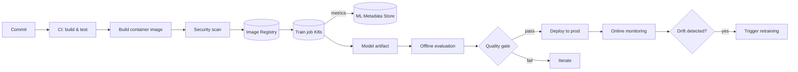

# C4 Modelling

## C1
1) C1 (System Context) → Mermaid Flowchart
Boxes = people/systems; one box = “Your System”.
Edges = relationships (with short purpose labels).
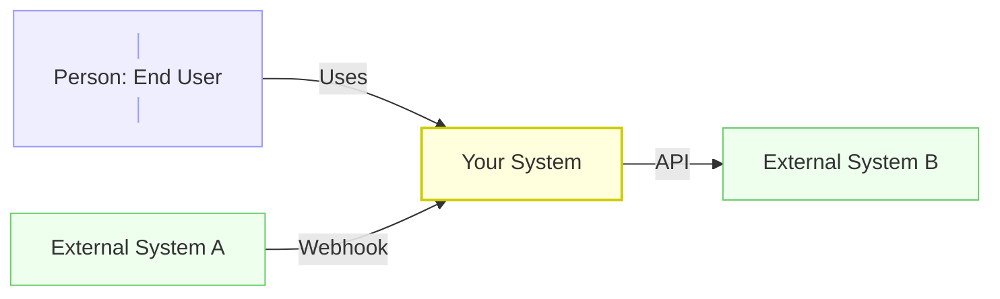

## C2
2) C2 (Container) → Mermaid Flowchart + subgraphs
Subgraph = your system boundary.
Nodes inside = containers (web, API, DB, queue, jobs, vector DB, etc).
Great for Kubernetes, MLOps, agentic AI building blocks.
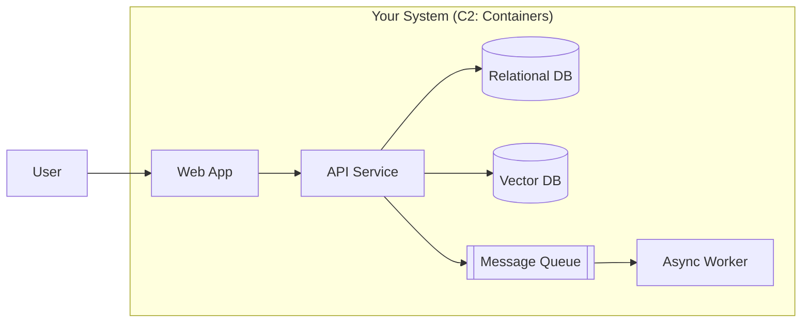

## C3
3) C3 (Component) → Mermaid Flowchart (zoom into one container)
Pick one container (e.g., API Service) and show main components.
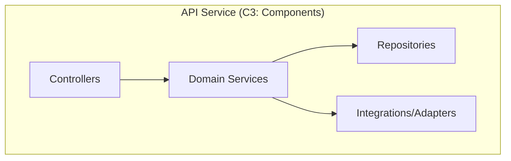

## C4
4) Dynamic view (C4 “Dynamic”) → Mermaid Sequence
Show runtime calls for a specific use case (e.g., agent planning + tool calls).
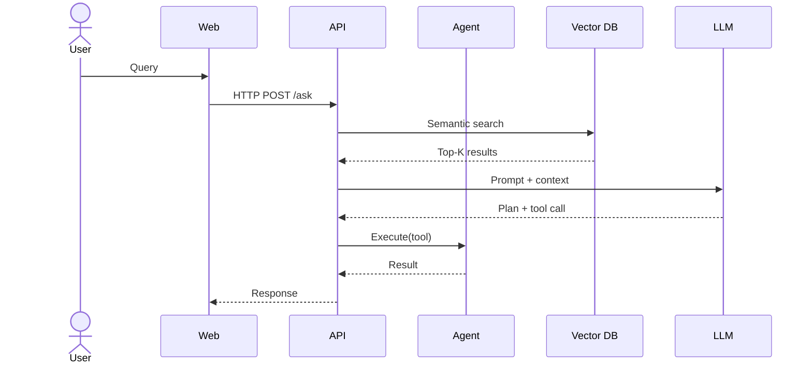
